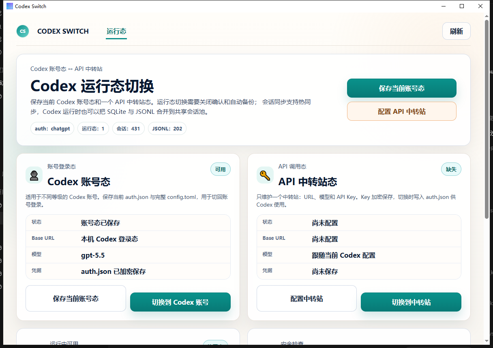

<div align="center">

# Codex Switch

**把固定的 Codex 账号态与 API 中转站态做成可验证、可回滚、可同步的本地运行态工作台。**

保存当前账号登录态；配置一个 OpenAI-compatible API 中转站；安装并配置 Image2 / Grok 搜索 Skill；切换、同步、删除和恢复等 live 数据操作前创建 DPAPI 加密、SHA-256 校验的完整快照；关闭态操作失败自动补偿；会话按 Codex 本地 `state_5.sqlite` + `sessions/**/*.jsonl` + `session_index.jsonl` 合并到共享会话池，并提供 dry-run、操作回执、操作历史、备份恢复和独立会话管理页。

[快速使用](#快速使用) · [下载 Release](https://github.com/mingisrookie/codex-switch/releases/latest) · [更新日志](CHANGELOG.md) · [安全说明](#安全说明) · [开发](#开发)


<br />
<br />



</div>

## 项目定位

Codex Switch 是一个 Windows 桌面小工具，用来在 **Codex 账号态** 和 **一个 OpenAI-compatible API 中转站态** 之间安全切换，同时保持本地会话可同步、可管理。

## 开发过程

本项目把 DXM 大项目协作规范也放进仓库，方便外部查看需求澄清、开发边界、链路说明和 PR 流程：

- [AGENTS.md](AGENTS.md)：Codex / AI 协作入口规则。
- [项目开发规范（AI协作）.md](项目开发规范（AI协作）.md)：开发、测试、文档同步和交付标准。
- [项目完整链路说明.md](项目完整链路说明.md)：运行态切换、会话同步和数据流说明。
- [项目文件结构说明.md](项目文件结构说明.md)：文件职责和维护边界。
- [开发者AI开发与PR提交流程.md](开发者AI开发与PR提交流程.md)：GitHub / PR / 发布流程。

## 能做什么

- 固定管理两个槽位：一个 Codex 账号态、一个 API 中转站态；当前版本不承诺任意数量账号池。
- 保存当前 Codex 账号登录态前验证 `auth_mode = chatgpt`；覆盖已有账号槽位必须确认，并保留加密历史版本。
- 配置一个 API 中转站：填写 Base URL、模型名和 API Key；Key 不回填，留空可保留已保存 Key，并可独立验证连接。保存失败时表单保留本次 Key 方便重试，保存成功或取消后销毁对话框内值。
- 在独立“技能”页安装固定来源的 `newapi-image2-client` 和 `grok-search`；Skill 按页面懒加载，不会让技能扫描故障污染运行态 Dashboard。
- Image2 与 Grok 分别填写自己的服务 URL 和 API Key；Key 使用当前 Windows 用户的 DPAPI 加密，Skill、非敏感配置、UI、回执和日志中都不保存明文。
- 分开显示“已保存”“当前运行”“最近验证”；只有 `auth.json` 和运行态绑定都精确匹配时才认定为当前态。
- 切换基于 live `config.toml` 应用运行态 overlay，只修改模型/service tier/provider 绑定，不覆盖 `model_instructions_file`、MCP、项目和其他全局设置。
- 切换、同步、删除、恢复可见和完整恢复返回操作 ID、备份引用、计数与警告；关闭态的切换、删除和完整恢复失败会尝试自动回滚。热同步失败只恢复 shared-sessions，不用旧快照覆盖可能正在变化的 live current Home。
- 命令完成后按钮会立即解除 busy，Dashboard 状态与操作历史在后台 best-effort 刷新；刷新失败会单独提示，不会把已经成功的 mutation 误报为失败。
- 自动识别 Codex 的 `sqlite_home` / `CODEX_SQLITE_HOME`，避免把会话库固定写死在 `%USERPROFILE%\.codex`。
- 单独执行会话热同步，把本地 SQLite 会话索引、`sessions/**/*.jsonl` 正文和 `session_index.jsonl` 合并到共享会话池，并按当前运行态修正会话 provider 元数据。
- 在“会话管理”页合并展示当前 Codex Home 与 shared-sessions，会话来源标记为“本机 / 共享池 / 两边都有”。
- 已归档会话默认不参与同步，只跳过不自动清理；可手动恢复可见或安全硬删除。
- 所有会话硬删除都需要确认；删除和恢复可见要求 Codex 已关闭，防止运行中的 Codex 覆盖结果。
- 可查看最近已验证备份并恢复其原始来源；恢复前还会创建安全快照。
- 敏感信息只加密存储，不在界面、日志、README 或导出内容里展示。

## 下载与运行

1. 打开 GitHub Releases。
2. 下载 Windows 版 `codex-switch.exe`。
3. 双击运行。

当前版本面向 Windows + Codex Desktop / Codex CLI 用户。

## 快速使用

### 1. 保存当前 Codex 账号态

先确保你当前的 Codex 能正常使用，然后点击：

```text
保存当前账号态
```

工具会先确认当前 `auth.json` 是 Codex 账号登录态，再把认证状态用 Windows DPAPI 加密保存。账号槽位已存在时必须确认覆盖；旧版本会归档到工具自己的历史目录。

### 2. 配置 API 中转站

点击：

```text
配置 API 中转站
```

依次填写：

- Base URL：例如 `https://your-relay.example.com/v1`
- 模型名：例如你的中转站支持的模型名
- API Key：只会加密保存，不会显示在界面上

说明：

- 如果 Base URL 没写 `http://` 或 `https://`，工具默认按 `https://` 处理；路径未以 `/v1` 结尾时会补上 `/v1`，且不接受内嵌用户名/密码、query 或 fragment。
- 非 loopback 的明文 `http://` 地址会在保存前明确警告，因为 Bearer API Key 会经明文传输。
- 首次保存必须输入 API Key；以后编辑时 Key 留空表示保留已加密保存的值。
- “验证连接”会用 Bearer 认证请求 `<Base URL>/models`，10 秒超时且禁止重定向；错误不会回显 Key 或响应正文。
- Codex CLI 当前不接受在 provider 配置里直接写 `api_key` 字段；本工具会把 Key 写入切换后的 `auth.json`，`config.toml` 只保存 provider 连接参数。

### 3. 切换到中转站

点击：

```text
切换到中转站
```

如果检测到 Codex 正在运行，工具会提示关闭 Codex。中转站切换前还会先验证连接。确认后会：

1. 再次检查 Codex 已关闭，并解析目标认证与 config overlay。
2. 为当前 Codex Home 和 shared-sessions 创建完整、已验证快照。
3. 同步当前会话到共享会话池。
4. 原子替换 `auth.json`，并在 live `config.toml` 上只应用运行态绑定字段。
5. 把共享会话写回当前 Codex Home，并在关闭态下把 `threads.model_provider` / JSONL `session_meta.payload.model_provider` 归一到目标运行态。
6. 精确校验目标运行态；任何一步失败都会尝试恢复两份快照，并在脱敏错误与本地操作记录中说明回滚终态。

如果 UI 只显示“模式匹配”而不是“当前运行”，按钮会显示“重新应用”；只有精确匹配才会跳过重复写入。

完成后重新打开 Codex CLI / Codex Desktop，就会使用中转站 API。

### 4. 切回 Codex 账号态

点击：

```text
切换到 Codex 账号
```

流程同样会先备份和同步会话，然后恢复之前保存的账号态 `auth.json`，并在 live `config.toml` 上应用账号态 overlay。

### 5. 会话热同步

点击：

```text
立即同步
```

这个操作只同步会话，不切换登录态；Codex 正在运行时也可以执行。执行前先展示 current ↔ shared 双向 dry-run 的新增/重复数量，确认后再创建两份完整快照并同步。同步策略是 **JSONL-first**：

- 以 `sessions/**/*.jsonl` 中的 `session_meta.payload.id` 作为可靠会话来源。
- 只合并存在正文 JSONL 的会话；只有 SQLite 行但找不到 JSONL 正文的孤儿记录会跳过，避免把不可打开的空会话同步出去。
- 合并 `session_index.jsonl`，让不同运行态看到同一批历史会话。
- 修复重复会话的缺失 JSONL / 错误 `rollout_path`；热同步不会为 provider 变化重写已经存在的 live JSONL，关闭 Codex 的切换流程才允许流式原子更新 `session_meta.payload.model_provider`，且不改用户或助手正文。
- 在关闭 Codex、允许替换已有文件的同步中，目标 JSONL 是源文件的严格旧前缀时可用增长后的版本原子替换；内容分叉时按内容哈希保留独立文件，不静默覆盖。
- `session_index.jsonl` 只追加缺失会话，并修复目标文件缺少结尾换行的情况。
- 已归档会话默认跳过同步，不会自动写回当前 Codex Home，也不会自动从 shared-sessions 清理。

如果热同步失败，后端会恢复 shared-sessions，但保留正在运行的 live current Home，避免旧快照覆盖同步期间的新变化；错误会给出 current 安全备份位置。处理锁或环境问题后可重试。

### 6. 会话管理

顶部切到：

```text
会话管理
```

这里会合并展示：

- 当前 Codex Home
- `%APPDATA%\codex-switch\shared-sessions`

同一个会话 ID 两边都有时，以当前 Codex Home 为准，shared-sessions 只补缺。你可以：

- 按全部 / 未归档 / 已归档 / 本机 / 共享池筛选，并可搜索、排序；列表每页 50 条。
- 用表格左上角“全选本页”复选框，或工具条的“全选本页 / 反选本页 / 清空选择”控制当前页；跨页选择会保留，当前页部分选中时显示 indeterminate 状态。列表只展示一行会话标题，过长自动省略。
- 选择会话后点击“恢复可见”：只更新当前 Codex Home 的归档状态，下次同步再正常参与。
- 选择会话后点击“删除所选”：关闭 Codex 并确认后，会先备份，再同时从当前 Codex Home 和 shared-sessions 硬删除。

删除规则：

- 已归档和未归档会话：都必须确认后才能硬删除。
- 一次硬删除超过 10 个会话时，还必须输入“删除 N”完成高风险确认。
- 不提供单独“排除同步”按钮；同步排除只使用 Codex 原生归档状态。

### 7. 技能安装与配置

顶部切到：

```text
技能
```

页面固定提供两项能力：

- **Image2**：安装目录为当前 `CODEX_HOME\skills\newapi-image2-client`，来源锁定为 `https://lcming951.com/image2-skill.zip`；当前审查基线 SHA-256 为 `648C192C2414BBFD9DBA36E264C01932BDCF7E2057A8BA2DA7006B40A94B332B`。默认 URL 是 `https://api.lcming951.com/v1`，模型固定为 `gpt-image-2`。
- **Grok 搜索**：安装目录为当前 `CODEX_HOME\skills\grok-search`，提供 Web/X 搜索脚本，模型固定为 `grok-4.5`；服务 URL 由用户填写。

使用顺序：

1. 点击“安装”，按提示关闭 Codex。
2. 安装成功后点击“配置”，填写服务 URL 和自己的 API Key。
3. 保存成功后重启 Codex，使新 Skill 被重新扫描。

安装/更新只接受上述两个固定 Skill ID，不接受前端传入任意源路径或目标路径。包体已内嵌到便携 EXE，运行时不会从当前管理员目录复制，也不会在线下载。已有未知目录或已修改文件不会被静默覆盖；确认覆盖时会先把完整旧目录移动到当前 Codex Home 下的 `.codex-switch\skill-backups`。安装事务在 `.codex-switch\skill-transactions` 留下原子 journal；进程中断后下一次安装会先保留已验证的新版本或恢复旧目录，再继续操作。

非敏感 URL/模型配置和 DPAPI 密文位于 `%APPDATA%\codex-switch\skills\<skill>`。API Key 输入框不会回填；首次必填，后续留空表示保留已经加密保存的 Key。Image2 自带 PowerShell helper，用正确的 Images API `/images/generations` / `/images/edits` 调用 `gpt-image-2`；Grok 脚本用 `/v1/responses` 调用 Web/X 搜索。

### 8. 备份恢复

运行态页只强校验按时间排序的最近 5 个候选，并列出其中通过验证的备份（最多 5 个）。恢复时：

1. 只允许选择 `%APPDATA%\codex-switch\backups` 的直接子目录，并校验 manifest、路径、文件大小和 SHA-256。
2. 按 manifest 的 `sourceRoot` 恢复到当前 Codex Home 或 shared-sessions，不能任意指定目标目录。
3. 恢复前为目标再创建一份安全快照；恢复失败则尝试恢复安全快照。
4. 恢复使用备份内的 `config.toml` 重新解析 `sqlite_home`，删除快照中不存在的额外会话文件，并对恢复后的 SQLite 执行 `PRAGMA quick_check`。

即使 Codex Home 扫描损坏，只要备份列表域成功加载，已验证备份的恢复入口仍保持可用。运行态页还会独立显示最近 10 条本机操作历史，包括动作、终态、操作 ID、完成时间和关联备份路径；后端读取上限为最近 20 条。

为避免历史备份越多、Dashboard 越容易被全量哈希阻塞，列表命令先在 mutation guard 临界区清理 legacy plaintext auth，随即释放锁；之后只扫描可读 manifest 元数据，并只对按 `createdAtMs` 排序后的最近 5 个候选执行 payload 大小/SHA-256 强校验。无效候选会跳过。真正恢复时会再次对用户选择的备份做完整强校验，不能拿列表时的结果代替恢复时检查。界面明确提示“仅校验并展示最近 5 份备份候选；旧备份不会自动清理。”

当前版本**没有自动 retention/prune**。`%APPDATA%\codex-switch\backups` 下的加密备份会随操作累积；自动保留周期、容量上限和安全清理入口是后续产品项，不能把“界面只展示最近备份”理解成旧备份已被删除。

## 文件位置

Codex Switch 默认操作当前用户的 Codex home。解析顺序：

1. 如果设置了 `CODEX_HOME`，优先使用它。
2. 否则使用当前 Windows 用户目录下的 `.codex`。

```text
C:\Users\<你>\.codex
```

工具自身数据保存在：

```text
%APPDATA%\codex-switch
```

主要包含：

- 加密后的运行态
- 切换/同步/删除/恢复前的加密备份
- 共享会话池
- 脱敏操作记录
- Image2 / Grok 的非敏感配置与 DPAPI 加密凭据

Codex 会话存储说明：

- 官方会话索引默认是 `state_5.sqlite`，但可能被 `config.toml` 的 `sqlite_home` 或环境变量 `CODEX_SQLITE_HOME` 改到别的位置。
- 会话正文位于 Codex home 下的 `sessions/**/*.jsonl`。
- `session_index.jsonl` 是会话索引增量文件；本工具会一起合并。
- `sqlite/codex-dev.db` 不是当前同步算法依赖的会话来源。

会话管理删除会同时处理当前 Codex Home 和 shared-sessions；恢复可见只处理当前 Codex Home。

工具自身关键目录：

```text
%APPDATA%\codex-switch\runtimes\plus
%APPDATA%\codex-switch\runtimes\relay
%APPDATA%\codex-switch\shared-sessions
%APPDATA%\codex-switch\backups
%APPDATA%\codex-switch\logs\operations.jsonl
%APPDATA%\codex-switch\skills\image2
%APPDATA%\codex-switch\skills\grok-search
```

受管 Skill 安装到当前 Codex Home：

```text
%CODEX_HOME%\skills\newapi-image2-client
%CODEX_HOME%\skills\grok-search
%CODEX_HOME%\.codex-switch\skill-backups
```

其中 `plus` 只是 Codex 账号槽位的内部兼容 ID，不代表套餐。

## 安全说明

- 不要把自己的 `auth.json`、API Key、备份目录或 `%APPDATA%\codex-switch` 上传给别人。
- 本工具不会在 UI 中展示真实 Token 或 API Key。
- Image2 / Grok Key 只以当前 Windows 用户可解密的 DPAPI 密文保存；前端只拿到“已配置/未配置”，安装包、Skill 文件、操作记录和回执不包含 Key。
- Skill 安装只处理两个编译期固定 allowlist；目标路径由后端从绝对 `CODEX_HOME` 推导，拒绝符号链接、junction/reparse point 和未确认的本地漂移。
- 工具自有备份中的 `auth.json`、`config.toml`、`state_5.sqlite`、`session_index.jsonl` 和会话 JSONL 载荷全部使用当前 Windows 用户的 DPAPI 加密；manifest 仅保存恢复元数据、大小和 SHA-256。
- SQLite 备份使用 SQLite Online Backup API，不直接复制可能不一致的 WAL/SHM 文件。
- 文件写入先写同目录临时文件并同步，再做原子替换；Windows 使用 `MoveFileExW(..., MOVEFILE_REPLACE_EXISTING | MOVEFILE_WRITE_THROUGH)`。
- 后端用进程内 try-lock + Windows 独占 `%APPDATA%\codex-switch\mutation.lock` 文件句柄串行化保存、验证、切换、同步、删除和恢复；同一进程或第二个 Codex Switch 进程已有写操作时，新操作会立即拒绝而不是并发修改同一批文件。锁由 RAII 句柄持有，正常结束或进程崩溃后由 Windows 自动释放，不依赖删除 lock 文件。
- 操作记录只保存 action、阶段、终态、操作 ID、备份目录和计数，不保存凭据、请求正文或自由文本错误。
- 会话管理里的删除是硬删除；工具会先备份并支持失败补偿，但操作前仍需确认选择范围。

## 开发

```bash
npm install
npm run tauri -- dev
```

常用检查：

```bash
npm test -- --run
npm run typecheck
npm run build
cargo fmt --manifest-path src-tauri/Cargo.toml -- --check
cargo clippy --manifest-path src-tauri/Cargo.toml --all-targets -- -D warnings
cargo test --manifest-path src-tauri/Cargo.toml
npm run tauri -- build
```

## License

MIT
