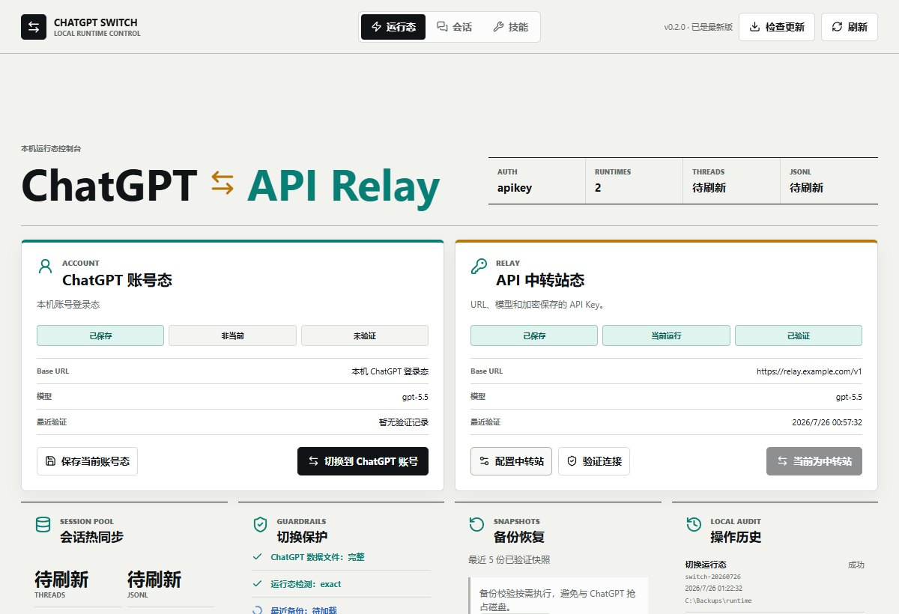

# ChatGPT Switch

在 **Windows** 上，一键在 **ChatGPT 官方模式** 和 **API 模式**之间切换。API 模式使用你自己配置的 OpenAI-compatible API（也常被称为 API 中转站）。

无需反复退出官方 ChatGPT 登录，也无需手工修改本地配置。ChatGPT Switch 会协助关闭 ChatGPT Desktop、切换请求配置、检查结果并重新打开应用；还提供本机会话管理、完整备份、诊断导出和应用内更新。

[下载最新版](https://github.com/mingisrookie/codex-switch/releases/latest) · [快速开始](#快速开始) · [安全与数据](#安全与数据) · [问题反馈](https://github.com/mingisrookie/codex-switch/issues)

> **先知道这些：**
> - ChatGPT Switch **不是 API 中转服务**，不会提供 ChatGPT 账号、API Key、模型额度或第三方接口。
> - 当前只支持 **Windows x64**；你需要自行安装 ChatGPT Desktop。只使用 API 模式时无需先登录官方账号，切回官方模式时才需要有效官方登录。
> - 这是独立开源项目，**不是 OpenAI 官方产品**，与 OpenAI 没有隶属或授权关系。

## 下载最新版

1. 打开 [GitHub Releases](https://github.com/mingisrookie/codex-switch/releases/latest)。
2. 下载唯一的 Windows 文件：`codex-switch.exe`。
3. 双击运行；可以直接配置 API 中转站。需要使用官方模式时，再让 ChatGPT Desktop 完成官方登录。

Release 页面是稳定版、版本说明和文件校验信息的唯一来源。`main` 分支可能包含正在开发的下一版本功能；日常使用请优先下载 Release，而不是自行使用仓库源码构建产物。

## 界面预览



**首次使用主要看三个区域：**左侧是官方模式，右侧是 API 模式，底部可进入会话、备份和诊断功能。截图来自早期界面，实际按钮和布局会随版本小幅调整。

## 适合谁

- 在同一台 Windows 电脑上交替使用官方 ChatGPT 与自有 OpenAI-compatible API 的用户。
- 不想每次切换都手动编辑 `.codex` 配置、关闭应用或重新登录的人。
- 希望在本机查看会话、创建恢复点、导出脱敏诊断信息的用户。

不适合：需要 API 托管、多人共享密钥、跨平台客户端，或没有权限使用目标 API 的场景。

## 它能做什么

| 功能 | 你得到什么 |
| --- | --- |
| 一键切换 | 在官方模式与 API 模式间切换，不必反复手改配置。 |
| 保留官方登录 | 切换请求方式，不替换或退出你的官方 ChatGPT 登录。 |
| 自动重开应用 | 切换前关闭受管的 ChatGPT Desktop，完成后尝试重新打开。 |
| 本机会话管理 | 查看、搜索、筛选、排序会话；可把归档会话恢复为可见。 |
| 会话合并与修复 | 在支持该功能的版本中，保守整理可安全合并的本机会话；冲突不会直接覆盖。 |
| 完整备份与恢复 | 手动创建恢复点，在需要时恢复本地受管数据。 |
| 诊断与更新 | 导出脱敏诊断包，并在应用内检查和安装正式版更新。 |

## 快速开始

1. 下载并运行 `codex-switch.exe`。
2. 确认 ChatGPT Desktop 已安装。只使用 API 模式时不需要先登录官方账号。
3. 在右侧点击 **“配置 API 中转站”**，填写 Base URL、模型名和 API Key；这就是 README 所说的**API 模式**。
4. 点击 **“切换到中转站”**，等待切换进度窗口完成并重新打开 ChatGPT Desktop。
5. 需要使用官方模式时，先在 ChatGPT Desktop 完成官方登录，再在左侧保存当前账号态并点击 **“切换到 ChatGPT 账号”**。

切换时，工具会关闭 ChatGPT Desktop、切换本地请求配置、检查结果并重新打开应用。界面中的旧按钮名称会保留兼容性；本文统一把它们称为“官方模式”和“API 模式”。

## 官方模式和 API 模式

| 模式 | 适用情况 | 工具做什么 |
| --- | --- | --- |
| 官方模式 | 你已登录官方 ChatGPT，并要继续使用官方请求方式 | 校验有效官方登录，恢复受管请求配置，并移除受管 API 模式配置。 |
| API 模式 | 你要通过自己有权使用的 OpenAI-compatible API 请求模型；可不登录官方账号 | 使用你填写的 Base URL、模型名和 API Key 写入受管请求配置，不伪造或创建官方登录文件。 |

API 模式只负责把本机 ChatGPT 的请求指向你提供的服务，不会替你验证服务商的计费、模型可用性、数据政策或账号权限。切换前请确认该 API 的来源可信且你有使用授权。

## 本机会话与同步

- ChatGPT Switch 不会默认把旧聊天记录批量上传到任何服务。
- API 模式下的新会话可由版本提供的本地会话功能继续管理；需要时可使用 **“会话合并与修复”** 或 **“同步此会话”** 等界面操作。
- 已归档会话默认不参与自动处理；可先在会话管理中选择 **“恢复可见”**。
- 同一会话出现内容冲突或无法可靠判断时，工具保留原内容并停止覆盖，而不是猜测哪个副本正确。
- 会话合并与修复不是长期备份。执行同步、迁移、恢复或清理前，建议先创建**完整备份**。

如果你启用了手机连续性或其他跨端能力，界面显示“已提交”只说明本机操作已完成；最终是否能在目标服务或设备中看到结果，仍取决于该服务和网络状态。

## 安全与数据

- **官方登录：**官方模式会读取并核对登录状态；API 模式允许登录文件不存在。无论哪种模式，工具都不会替换、写回或伪造官方登录文件。
- **API Key：**保存到工具槽位时会使用当前 Windows 用户的 DPAPI 加密；页面不会把 Key 回填出来。
- **运行期间：**API 模式生效时，当前实现需要把 API Key 以 bearer token 形式写入本地受管的 `config.toml`，供 ChatGPT Desktop 发起请求；切回官方模式会删除这段受管 API 配置和其中的 Key。
- **本地数据：**切换会修改受管请求配置；你主动执行会话迁移、备份、恢复或删除恢复点时，才会处理相应的本地会话和备份数据。
- **诊断包：**导出前会做脱敏处理，不应包含 API Key、登录 token、聊天正文或请求/响应正文；分享前仍建议自行检查文件。
- **网络边界：**工具不会主动上传历史聊天；但在 API 模式下，你发出的新请求会发送给你配置的 API 服务，其数据处理规则由该服务决定。

详细边界见 [安全与数据说明](docs/SECURITY.md)。

## 当前限制

- 仅支持 Windows x64；暂不支持 macOS 或 Linux。
- 当前固定管理 **一个官方模式** 和 **一个 API 模式**，不是多账号或多 API 配置管理器。
- 切换需要 ChatGPT Desktop 处于可安全关闭的状态；正在运行的相关写入任务可能让操作暂停或拒绝执行。
- 本地会话迁移、合并与修复会因版本和数据状态而显示不同的前置条件；请以当前 Release Notes 和界面提示为准。
- API 服务的稳定性、计费、模型能力、数据保留和合规性不由本项目控制。

## 常见问题

### 为什么项目叫 ChatGPT Switch，下载文件却叫 `codex-switch.exe`？

ChatGPT Switch 是面向用户的产品名称；`codex-switch.exe` 是用于保持历史更新兼容性的发布文件名。下载时以 Release 页面中的唯一文件为准。

### 它会让我退出 ChatGPT 官方账号吗？

不会。工具切换的是本地请求配置，不会替换或写回官方登录文件。

### 没有登录官方账号，可以使用 API 模式吗？

可以。先配置 API 中转站再切换即可；工具不会为了 API 模式创建假的 `auth.json`。之后若要切回官方模式，需要先完成有效的官方登录。

### 它会上传我的历史聊天记录吗？

不会默认上传旧历史。API 模式下的新请求会发送给你配置的服务；可选的会话操作由你在界面中明确触发。

### 支持多个官方账号或多个 API 配置吗？

当前不支持账号池或 API 配置池：一次管理一个官方模式和一个 API 模式。

### 切换失败后会发生什么？

工具会停止后续操作，并在能安全恢复的地方保留或恢复原配置。切换进度窗口会区分登录、配置、会话视图、独立写入进程、并发任务、关闭、写后验证和启动目标等原因；按提示排除阻断后再重试，必要时导出诊断包。

### 为什么切换时 ChatGPT Desktop 会被关闭？

这是为了避免应用运行时覆盖配置或继续使用旧请求方式。切换完成后，工具会尝试重新打开它。

### API Key 保存在哪里？

保存到工具槽位时使用 Windows DPAPI 加密。API 模式正在运行时，Key 会临时作为受管 `config.toml` 配置的一部分存在于本机；切回官方模式会删除该受管配置。

### 会话合并与修复和完整备份有什么区别？

前者用于整理或修复可安全判断的本机会话关系；后者是可恢复的完整本地恢复点。两者不能互相替代。

### 支持 macOS 或 Linux 吗？

暂不支持。目前发布和测试目标是 Windows x64。

### 这是 OpenAI 官方工具吗？

不是。它是独立开源项目，不代表 OpenAI，也不提供 OpenAI 账号或服务。

## 可选扩展

**Image2** 和 **Grok 搜索**位于应用的“技能”页面，和官方模式/API 模式切换彼此独立。**不安装它们不会影响核心切换功能。**

安装来源、配置方式和隐私边界见 [可选技能说明](docs/SKILLS.md)。

## 技术文档

- [用户操作指南](docs/USER_GUIDE.md)：会话、备份、恢复、诊断和更新的操作说明。
- [安全与数据说明](docs/SECURITY.md)：本地文件、API Key、会话和诊断包的边界。
- [Release 验证说明](docs/RELEASE_VERIFICATION.md)：如何从 Release 页面确认版本和校验信息。
- [完整运行链路](项目完整链路说明.md)：请求切换、会话、备份和更新的技术说明。
- [更新日志](CHANGELOG.md)：各正式版本的用户可见变更。

## 开发和构建

需要 Node.js、Rust 和 Windows 开发环境。常用检查：

```powershell
npm ci
npm run typecheck
npm test -- --run
npm run build
npm run tauri -- build
```

发布流程和完整质量门见 [开发者 AI 开发与 PR 流程](开发者AI开发与PR提交流程.md) 与 [Release 验证说明](docs/RELEASE_VERIFICATION.md)。

## License / Disclaimer

本项目采用 [MIT License](LICENSE)。使用 API 模式前，请自行确认 API 服务、账号、数据处理和费用符合你的需求；请勿把 API Key、登录 token、聊天正文或诊断包中的敏感内容提交到公开 Issue。
