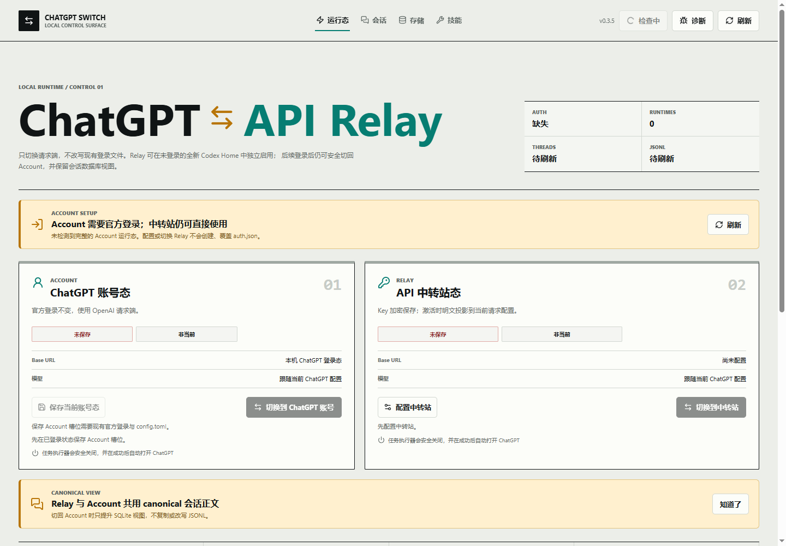
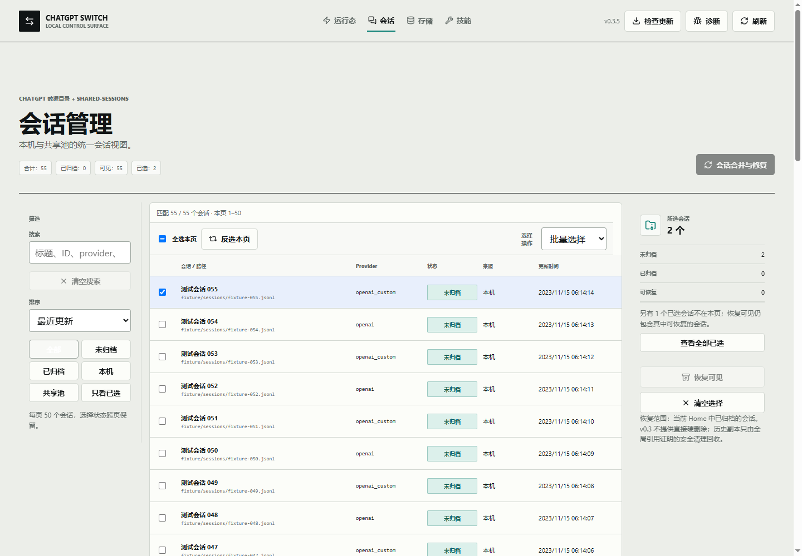

<h1 align="center">ChatGPT Switch</h1>

<p align="center"><strong>在 Windows 上切换官方账号与自有 API，让本机会话继续留在手边。</strong></p>
<p align="center">无需反复退出登录，也不用每次手工编辑配置。切换、会话、备份与诊断，在一个桌面工具里完成。</p>

<p align="center">
  <a href="https://github.com/mingisrookie/codex-switch/releases/latest"></a>
  <a href="https://github.com/mingisrookie/codex-switch/actions/workflows/ci.yml"></a>
  
  <a href="LICENSE"></a>
</p>

<p align="center">
  <a href="https://github.com/mingisrookie/codex-switch/releases/latest/download/codex-switch.exe"><strong>下载 Windows 版</strong></a>
  · <a href="https://github.com/mingisrookie/codex-switch/releases/tag/v0.4.0">v0.4.0 更新说明</a>
  · <a href="#快速开始">快速开始</a>
  · <a href="docs/USER_GUIDE.md">使用指南</a>
  · <a href="https://github.com/mingisrookie/codex-switch/issues">反馈问题</a>
</p>

> **独立开源项目，非 OpenAI 官方产品。** 本工具不提供账号、API Key 或模型额度，也不是 API 中转服务。使用前需自行安装兼容的 ChatGPT Desktop，并准备有权使用的 API 服务；只使用 API 模式时无需先登录官方账号。

## 界面预览



**运行态：**官方账号与 API 中转站分开配置，保存状态与当前激活状态分开显示。切换时展示实际执行阶段，失败时提供对应的处理提示。



**会话管理：**搜索、筛选、排序和跨页选择集中在同一页。以上为 v0.3.5 界面示例，v0.4.0 另新增兼容性面板和高级存储入口。截图由桌面程序在隔离测试环境中实际截取，会话为示例数据，不包含真实账号、密钥或聊天内容。

## 它解决什么问题

| 你要做的事 | ChatGPT Switch 的处理方式 |
| --- | --- |
| 在官方账号和自有 API 之间切换 | 管理两种请求配置，协助关闭受管应用，检查切换结果，再尝试重新打开。 |
| 切换时保留官方登录 | 官方 `auth.json` 只读，不替换、不伪造；切回官方模式需要有效官方登录。 |
| 从大量会话中找到目标 | 按标题、ID、provider 或路径搜索，配合来源、归档状态及更新时间筛选和排序。 |
| 核对批量操作范围 | 每页 50 条，跨页保留选择；“只看已选”和页外选择提示帮助确认处理范围。 |
| 恢复归档会话或整理本机数据 | 显式执行“恢复可见”及符合前置条件的“会话合并与修复”；冲突保留，不猜测覆盖。 |
| 留下恢复点、排查问题或更新 | 手动完整备份与恢复、脱敏诊断导出、应用内正式版更新。 |

## v0.4.0 更新重点

**中转站默认使用 HTTP Responses，需要 WebSocket 时再显式启用。** 自定义 API 网关路径会原样保留，不再自动多加一层 `/v1`。保存或切换成功只代表本地请求配置已应用，不能替代真实服务连接验证。

本版新增本地结构兼容性面板，并将迁移、清理和恢复集中到“高级存储”。不支持的数据库结构或未完成的 SQLite 日志会阻止相关写入；错误提示保留明确分类，避免遇到异常时猜测覆盖数据。v0.3.5 的搜索提速、稳定分页和跨页选择保持不变。

发布页同时提供 Windows 程序和 [Rust 组件清单](https://github.com/mingisrookie/codex-switch/releases/download/v0.4.0/codex-switch.cdx.json)，并记录 GitHub 构建来源／组件清单证明。EXE 尚未使用商业 Authenticode 证书（**NotSigned**）；构建证明不能替代 Windows 代码签名或终端防护检查。详细变化见 [更新日志](CHANGELOG.md#v040---2026-09-08)。

## 快速开始

### 1. 下载并打开

下载 [最新正式版 `codex-switch.exe`](https://github.com/mingisrookie/codex-switch/releases/latest/download/codex-switch.exe)，放到便于查找的目录后运行。当前只发布 **Windows x64 便携版**，无需 Node.js 或 Rust 开发环境。

已安装旧版的用户，可在应用顶部选择 **“检查更新”**。下载、版本说明和校验信息统一以 [GitHub Releases](https://github.com/mingisrookie/codex-switch/releases/latest) 为准；`main` 中的提交不等于已经发布的安装文件。

### 2. 配置 API 模式

在“运行态”页点击 **“配置中转站”**，填写 Base URL、模型名和 API Key，传输方式默认选择 HTTP Responses；仅服务商明确支持时选择 WebSocket。保存后点击 **“切换到中转站”**。等待进度窗口完成，再在重新打开的应用中使用。

远程 API 地址需要 HTTPS；仅本机回环地址允许 HTTP。工具检查本地配置，不会在切换前探测 `/models`；服务是否支持当前客户端、模型和传输协议，需要由实际请求确认。

### 3. 需要时切回官方账号

先在 ChatGPT Desktop 完成官方登录，再回到本工具点击 **“保存当前账号态”** 和 **“切换到 ChatGPT 账号”**。API 模式可以在尚未登录官方账号时单独使用，但不能替代官方登录。

切换前先结束正在进行的任务。独立 Codex CLI 或其他写入进程可能阻止安全切换；工具不会为了通过检查而结束无关 CLI 进程。

## 数据与安全边界

**API Key 的保存与使用是两件事。** 保存到工具槽位时使用当前 Windows 用户的 DPAPI 加密，界面不回填 Key。API 模式激活后，为供客户端发起请求，Key 会以 bearer token 形式出现在本机受管的 `config.toml` 中；切回官方模式会移除这段受管配置。不要公开分享该文件。

**历史会话不会被默认批量上传。** API 模式下发出的请求会交给你配置的服务处理，请自行确认服务商的数据政策、权限和费用。会话迁移、恢复和清理是独立的本地操作；执行高风险维护前应先创建完整备份。

**诊断只在你主动导出后分享。** 导出会进行脱敏，但发送前仍应检查；不要把凭据、聊天正文或未检查的诊断文件提交到公开 Issue。详细说明见 [安全与数据](docs/SECURITY.md)。

## 当前支持范围

- **Windows x64，一个官方账号槽位和一个 API 槽位。** 暂不提供多账号池、多 API 配置池、macOS 或 Linux 版本。
- API 可用性取决于本机客户端与目标服务的兼容性；默认使用 HTTP Responses，服务商明确支持时可选择 Responses WebSocket。
- 会话合并、迁移和清理需要满足界面提示的前置条件，不应代替长期备份；“本机已提交”也不等于手机或远端服务已收到。

<details>
<summary><strong>常见问题</strong></summary>

### 为什么下载文件叫 codex-switch.exe？

ChatGPT Switch 是产品名称。`codex-switch.exe` 是历史发布文件名，保持不变是为了兼容已有的一键更新流程。

### 切换失败后应该做什么？

先查看进度窗口中的具体原因。登录、配置、会话视图、独立写入进程以及应用启动失败，需要不同的处理方式。结果不明确时不要反复重试或手工覆盖文件，先导出诊断信息并保留现状。

### 会话搜索和筛选会修改聊天内容吗？

不会。搜索索引只在内存中使用。恢复可见、合并和其他维护操作需要通过各自的按钮明确发起。

### “恢复可见”会处理搜索结果之外的选择吗？

会处理全部已选项中符合条件的本机归档会话，不限于当前页。页外选择提示和“查看全部已选”用于帮助你核对范围；清空搜索不会取消选择。

### 必须安装 Image2 或 Grok 搜索吗？

不需要。它们位于“技能”页，与核心切换功能独立；来源、配置与隐私边界见 [可选技能说明](docs/SKILLS.md)。

</details>

## 文档与开发

| 文档 | 内容 |
| --- | --- |
| [使用指南](docs/USER_GUIDE.md) | 会话、备份、恢复、诊断与更新的具体操作。 |
| [安全与数据](docs/SECURITY.md) | 凭据、本地文件、第三方 API 和诊断包的边界。 |
| [版本验证](docs/RELEASE_VERIFICATION.md) | 核验版本、下载文件和发布流程。 |
| [完整运行链路](项目完整链路说明.md) | 请求切换、会话存储、备份和更新的实现说明。 |
| [更新日志](CHANGELOG.md) | 各版本变化与兼容性说明。 |

从源码开发需要 Node.js、Rust 与 Windows C++／SDK 工具链：

```powershell
npm ci
npm test -- --run
npm run typecheck
npm run tauri -- dev
```

完整构建、测试和发布步骤见 [开发与发布流程](开发者AI开发与PR提交流程.md)。正式 EXE 由 GitHub Actions 的版本 tag 流水线构建并发布，不从开发工作区直接上传。

---

[MIT License](LICENSE) · 独立开源项目，与 OpenAI 无隶属或授权关系。
